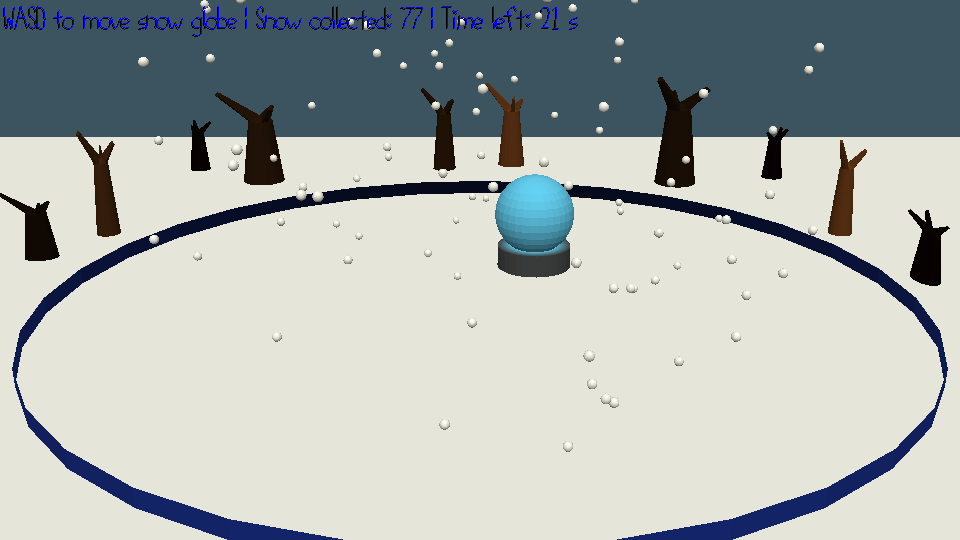

# a snow globe is not a game

Author: Yoseph Mak

Design: This a collection game where you move around a "basket" to collect objects. This version is in 3D, so you move the snow globe around on the plane to catch as much snow as possible.

Screen Shot:

How To Play:

Use the WASD keys to move the snow globe around on the plane (within the bounds of the blue circle). If a snow particle touches the globe, you get a point. Otherwise, it touches the ground. The goal is to get as many points as possible.

Snow particles further away are smaller than closer ones, so that can help you gauge where the snow falls.

This game was built with [NEST](NEST.md).

Credits:
- The [course website](http://graphics.cs.cmu.edu/courses/15-466-f24)
- Matei Budiu for assistance with getting multiple copies of an object to work (in my case, the snow)
- Other citations within files are provided when needed.